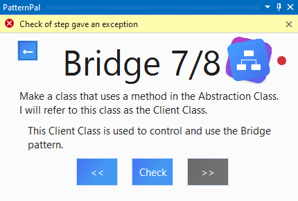

# Error handling

Calls to the background process can fail. Because the way these failures should be handled depends
on the call being made, the caller is responsible for handling the failure. To present an error
message to the user, use the `GrpcHelper.ShowErrorMessage` method.

```csharp
GrpcHelper.ShowErrorMessage("Something went wrong");
```

As this message is presented to the user, it should not include technical details. Try to keep it
short and informative.



## Background Process Crash

It may occur that the background process disappears for some reason, either because it crashed, or
because the process was killed. To provide the best user experience we add a restart button to the
error message if this happens. When the user presses this button a new background process is
started.
