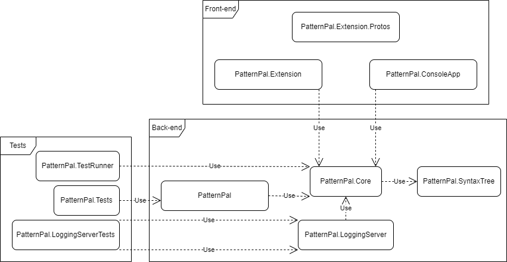

# Overview
PatternPal's solution consists of a multitude of projects, each encapsulating a specific part of the eventual application. More details regarding PatternPal's components, design choices and included guides can be accessed via the menu. A quick overview:

## Projects
### Front-end
- `PatternPal.Extension` is where the extension front-end and relating logic is defined.
- `PatternPal.Extension.Protos` is where the proto-definitions for communication between the extension, the background service and the logging server are defined.
- @PatternPal.ConsoleApp provides a CLI-application for accessing the recognizer-functionality of PatternPal.

### Back-end
- `PatternPal` is where the background service of PatternPal lives.
- @PatternPal.Core is where all core functionality (recognizers, checks, the recognizer runner and step-by-step) is defined.
- @PatternPal.SyntaxTree is where the custom syntax tree for code analysis is created.
- @PatternPal.LoggingServer is where the remote logging server for data processing is defined.

### Tests
- @PatternPal.TestRunner is where a deprecated test runner for automatic assessment of supplied pattern implementation was handled.
- `PatternPal.Tests` is where most unit and integration tests for PatternPal are defined.
- `PatternPal.LoggingServerTests` is where validation tests for PatternPal's logging server are defined.

### etc
- `PatternPal.ProgSnapExport` is where the tool to export the logging data in the [Progsnap2](https://cssplice.github.io/progsnap2/) specification is defined.

## Diagram
