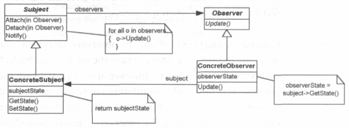

# Observer
## Introduction
An observer pattern is a behavioral design pattern that lets you define a subscription mechanism to notify multiple objects about any events that happen to the object they're observing. This patterns is sometimes refered to as Event-Subscriber or Listener.  The explanation on this page is based on the definition of previous development teams and the book Design patterns explained[^1].

### Context of use
The observer pattern is useful to notify objects about subjects that they can subscribe to. A client class can add observers to a subject which updates the observers on certain events. 

### Example of use
A real life example is subscribing to a news paper which will send you new issues when they are published. The interested people do not have to check the with the publisher whether there is a new issue. And the publisher does not have to send out issues to everyone, even the not interested people. 

## Explanation of Architecture

The **Subject** is the interface for the `ConcreteSubjects` it consists of a `Attach()`, `Detach()` and `Notify()` methods which should be implemented in the `ConcreteSubjects`. 

The **Concrete Subject** class implements the `Subject` interface and it's methods. It holds a list of all the `Concrete Observers`, this list can be altered by using the `Attach()` and `Detach()` methods. The `Notify()` method is used to update all the `Concrete Observer` instances. In addition to this can it store a state field. When this state value changes it is meant to notify the `Concrete Observer` instances. A state value can also be send via a method in the class. 

The **Observer** interface declares the notification interface. In most cases, it consists of a single `update` method. The method may have several parameters that let the subject pass some event details along with the update.

The **Concrete Observer** perform some actions in response to notifications issued by the subject. All of these classes must implement the same interface so the subject is not coupled to concrete classes. Normally the subject passes some contextual data as arguments with a notification. The subject can also pass itself as an argument, so the observer can fetch the data itself. Another possibility is keeping a observer state, in this way it can get the information itself whenever it wants.

The **Client** creates the publisher and observer objects separately and then registers observers for publisher updates.

## Requirements
The priority of a requirement is noted with the (low)-(mid)-(high)-(knockout) criteria.

**Observer**
1. (Knockout) Is an interface.
2. (Knockout) Has public or internal `update()` method.

**Concrete Observer**
1. (Knockout) Is a class that implements the `Observer` interface.

**Subject** 
1. (Knockout) Is an interface
2. (Knockout) Has a public or internal method that has a parameter with as type `Observer`.

**Concrete Subject**
1. (Knockout) Is a class that implements the `Subject` interface.
2. (Knockout) Has a private field with as type a Observer list, `observers`.
3. (Knockout) Has a public or internal method that has a parameter with as type `Observer` that uses the list `observers`.
4. (Knockout) Has a public method that uses the `observers` list and uses the `update()` method in `Observer`.
5. (High) Has either,
    1. (High) Both,
        1. (High) A private or protected field or property `mainState`.
        2. (High) Has a public or internal method that uses `mainState`.
    2. (High) A public or internal method with a parameter.

**Client**
1. (Mid) Creates the Subject.
2. (Mid) Creates a Concrete Observer.
3. (Low) Uses a method as described in `Concrete Subject` 3.
4. (Low) Uses the method as described in `Concrete SubjecThi` 4.

## Step By Step Steps
| Steps | Requirements                                                                                                                                                          | Explanations                                                                                                                                                                                                                                                         |
|-------|-----------------------------------------------------------------------------------------------------------------------------------------------------------------------|----------------------------------------------------------------------------------------------------------------------------------------------------------------------------------------------------------------------------------------------------------------------|
| 1     | Make an interface with an internal or public method. We refer to this interface as the Observer Interface.                                                            | This interface serves as the base for the Concrete Observers.                                                                                                                                                                                                        |
| 2     | Create a class that implements the Observer Interface. We will refer to this class as the Concrete Observer.                                                          | This is a Concrete Observer class which instances are updated if a Concrete Subject notifies them.                                                                                                                                                                   |
| 3     | Create an interface with an internal or public method that has a parameter with as type the Observer Interface. We will refer to this as the Subject Interface.       | This interface serves as the base fot the Concrete Subjects to which Concrete Observers can subscribe. The method here will in the Concrete Subjects be implemented as the `attach()` method.                                                                        |
| 4     | Create a class that implements the Subject interface. We will refer to this class as the Concrete Subject class.                                                      | This is a Concrete Subject class which can notify the Concrete Observers if they are subscribed.                                                                                                                                                                     |
| 5     | Add a private field with as type a Observer list, we will refer to this field as the 'observers'.                                                                     | In this list the Concrete Observers are stored which we want to update if the Concrete Subject notifies them. We can not check the type of the field thus make sure you do this correctly, it should look like: "List<Observer> observers = new List<Observer>();".  |
| 6     | Add a public or internal method, that has a parameter with as type Observer that uses the list `observers`. We will refer to this method as the 'attach()' method.    | This method will be used to subscribe or unsubscribe Concrete Observer instances to the Concrete Subject. It could thus be a logical step to implement two methods with these requirements. One for attaching the Observer to the list and one to detach.            |
| 7     | Add a private or protected field or property, which we will refer to as `mainState` and add a public or internal method that uses this field or property.             | This field or property will be used to store the state in. With this state it can be determined that the observers should be notified. The method that comes with the field or property is then used to change the state.                                            |
| 8     | Add a public method that uses the `observers` list and uses the `update()` method of the `Observer Interface`. We will refer to this method as the 'notify()' method. | This method will be used to notify the Concrete Observers in the observers list. For the implementation of this method it thus seems logical to loop through the observers list and notify each instance.                                                            |
| 9     | Create a class that creates a Concrete Subject instance and creates an Concrete Observer instance.                                                                    | This will be the Client class which is used to control the Observer pattern.                                                                                                                                                                                         |
| 10    | Use the `attach()` method as described in step 6 in the Concrete Subject.                                                                                             | You should thus add the just created Concrete Observer to the observers list using the 'attach()' method created in step 6.                                                                                                                                          |
| 11    | Use the 'notify()` method as described in step 7 in the Concrete Subject.                                                                                             | You should thus update the just added Concrete Observer using the method created in step 7.                                                                                                                                                                          |

## References
[^1]: A.Shalloway, J.R.Trott, Design Patterns Explained - A new perspective on Object Oriented Design (p.270-275). (2001)
