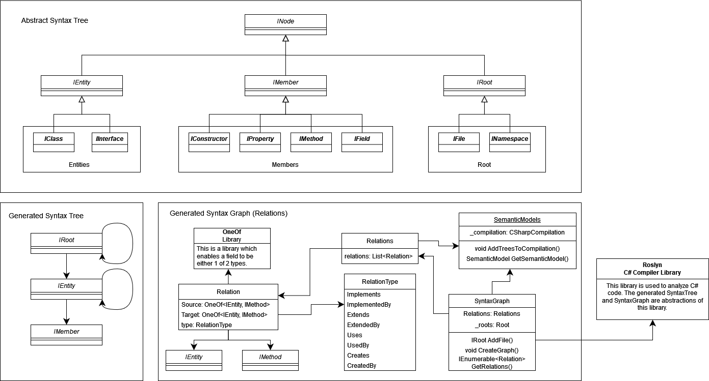

# Analyzing code

## Syntax Graph

To analyze the user's input code, an abstraction of the Microsoft
library Roslyn is used. This library is the API of the C# compiler. The
abstraction is called the Abstract Syntax Tree (AST), which is displayed
in the [appendix](#appendix). In this AST, three types of nodes can be
seen:

-   IRoot
-   IEntity
-   IMember

An actual syntax tree is generated from the given tree, and its
structure can be observed on the left-hand side of the [appendix](#appendix). 
Notably, the IEntity and IRoot have self-referencing nodes in this structure, as a class can contain another
class and a namespace can contain other namespaces. The SyntaxGraph
class generates the actual tree and graph based on these structures,
which can be seen on the bottom-right side of the [appendix](#appendix). To do this, all code files are loaded into
the SyntaxGraph using AddFile(), and an IRoot is created from each file.
The IEntities and IMembers of each IRoot are analyzed and created. Once
all files are loaded and the syntax tree is constructed, relations are
established between the nodes using the CreateGraph method. This is
accomplished by examining the descendant nodes of each IEntity or
IMethod for a particular type of roslyn syntax which denotes there is a
particular relationship, a feature provided by Roslyn. When descendant
Roslyn syntax nodes that relate to a specific IEntity or IMethod are
identified, the corresponding IEntity or IMethod is found using the
SemanticModel, which is another Roslyn feature. This is for example
necessary when a method uses another method, the line where the method
is called is a descendant node, but not the actual method which is
called. this declaration node, which the descendant node refers to, can
be obtained with the SemanticModel, and is the same as the Roslyn
SyntaxNode saved in one of the saved IEntities or IMethods. Both sides
of a relation are now obtained, and the relation can be established.

## Appendix

