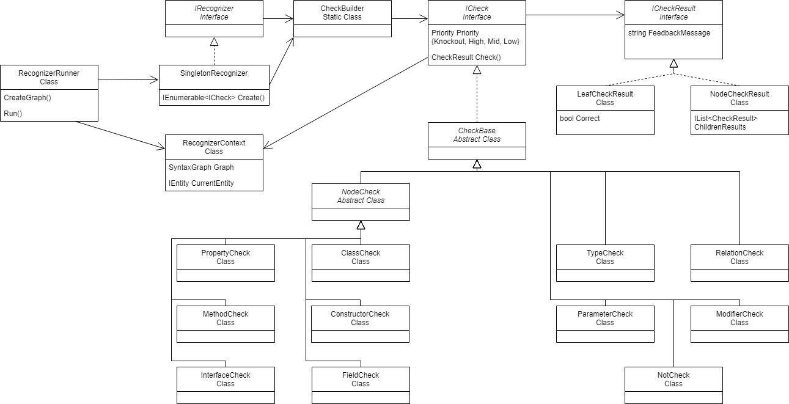

# Functioning of the recognizers

The [appendix](#appendix) can be used as a tool accompanying the reading of this section.

## What is a recognizer

A recognizer tries to detect a specific design pattern in the
programmer's code. Such a recognizer comprises a collection of checks
examining the static code and identifying the critical parts of the
detected design pattern. These recognizers are created by dynamically
composing modular checks using the fluent design pattern.

### Checks
A recognizer is build from multiple checks which are also build from other checks, each check 
searches through the SyntaxGraph to look for specific nodes or relations between nodes.
More information about the individual checks can be found [here](checks.md).

### Priority

Each check has a priority. This indicates the importance of the
characteristic the check validates being present in the design pattern.
There are four levels of priority, Knockout, High, Mid, and Low. A check
with a Knockout priority must succeed for the design pattern to be
considered at all. A certain predetermined percentage of the High checks
must succeed as well for the pattern to be considered. If this
percentage is met, but not all high checks are met, then these
unfulfilled checks are either critical points of improvement or an
indication the pattern is not implemented after all. Mid and Low checks
do not serve as determinants for the consideration of a pattern but
rather function as qualifiers for assessing the level of proficiency in
the implementation of the design pattern. They are used as final pattern
qualifiers and serve as points for further improvement.

### CheckResult

A CheckResult is the result of a check. Similar to how a check can be a
collection of checks, the result of a check can be a collection of
CheckResults. Each CheckResult has a feedback message, which provides
information about what happened when the check was run. For example, it
shows for what reason a check did not succeed.\
A leaf check corresponds to a LeafCheckResult. Such a CheckResult either
did succeed or did not. Therefore, it has a Correctness property. A node
check corresponds to a NodeCheckResult. It has a list of
NodeCheckResults and LeafCheckResults.

### CheckBuilder

The CheckBuilder is a static class that makes it possible to make a
collection of checks for a recognizer. It contains a number of static
methods, each one for one specific check, like Class() which returns a
ClassCheck, and Method() which returns a MethodCheck. These methods can
be used by a recognizer to create checks in a fluid way.

### Example recognizer

This recognizer checks whether there is a class which has a static,
non-private method which is used by one of its other methods.
```csharp
internal class ExampleRecognizer : IRecognizer
{
  internal IEnumerable< ICheck > Create()
  {
     MethodCheck instanceMethod =
            //this starts a collection of checks for a method
            Method( 
                Priority.Knockout,
                //the first check in the collection is a modifier check
                Modifiers( 
                    Priority.Knockout,
                    //requiring the method to be static
                    Modifier.Static 
                ),
                //the second check in the collection is a not check
                Not( 
                    Priority.Mid,
                    Modifiers(
                        Priority.Low,
                        //requiring that this method is not private
                        Modifier.Private 
                    )
                )
            );

    //this starts a collection of checks for a class
    yield return 
        Class( 
            Priority.Knockout,
            //the first check is the previously defined method check
            instanceMethod,
            //the second check in de collection is also a method check
            Method( //this starts a new collection of checks
                Priority.Low,
                //the first check in this collection is a uses check
                Uses( 
                    Priority.Low,
                    //requiring the method to use the other method 
                    instanceMethod.Result 
                )
            )
        );
  }
}
```

## Running a recognizer

The recognizers are run on the code base of the user in the Run()
function of the RecognizerRunner.\
The Runner creates a SyntaxGraph of the code base. Here the code base
gets represented as a graph of entities (see
the [syntax graph explanation](syntax_graph.md)). It also creates a RecognizerContext which
gets a reference to this graph. Then it goes through each recognizer and
gives each entity of the graph in turn, as root entity, together with
the context, to the recognizer. The recognizer then runs all of its
checks based on this root entity as the entry point to the code base. In
other words, the root check of the recognizer will correspond to the
root entity given.

## Result of a recognizer

Currently, a recognizer generates a list of all potential linkages
between the entities in the graph and the checks from the recognizer's
checklist. This is done in such a way that leaf checks pass and the
structure of the checklist is maintained. What is meant by structure is
the following: if a recognizer contains a method check in a class check,
the identified entity linked to the class check should include the
identified entity linked to the method check.\
Filtering based on priorities is not yet implemented.

## Appendix


