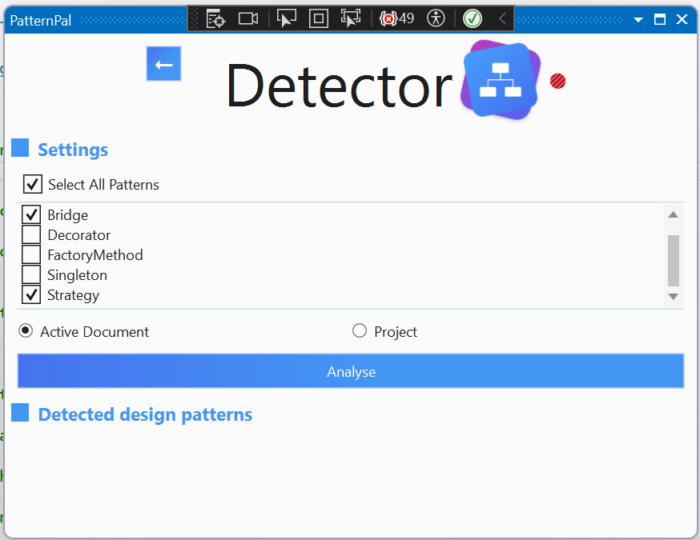
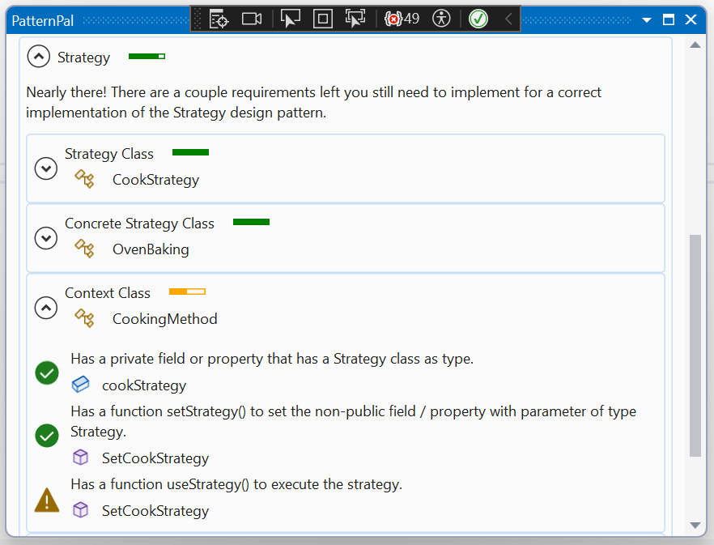
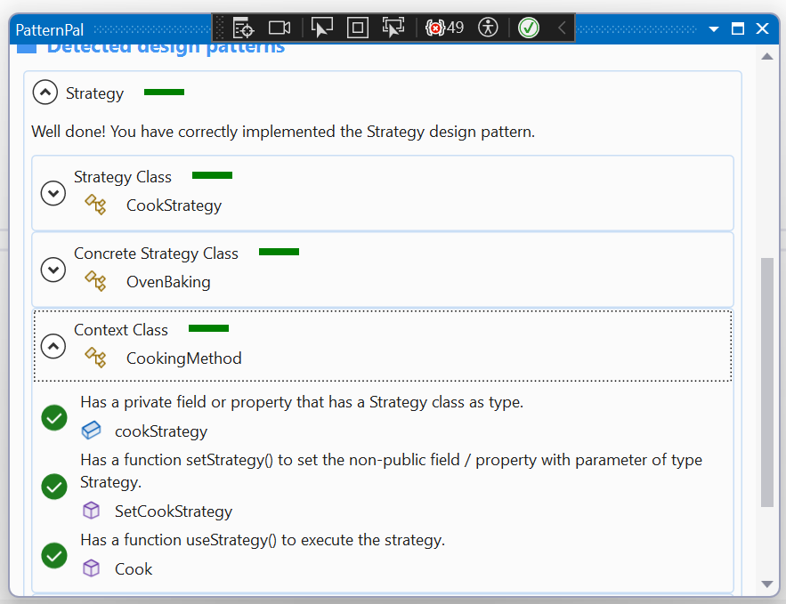

# Recognizer User Guide

PatternPal's recognizer component is designed to identify and analyze code patterns in your projects. This section provides an overview of the functionality and features of the recognizer.

## Pattern Identification

The recognizer component analyzes your codebase to identify specific design patterns and other relevant patterns. By understanding the structure and organization of your code, PatternPal can provide insights and recommendations for improvement.

### Step 1: Launch PatternPal

To begin using the recognizer functionality, open PatternPal within the Visual Studio IDE. This can be found in the main menu under `View > Other Windows > PatternPal`.

*Figure 1: Launching PatternPal*

### Step 2: Select Project

Choose if you want to analyze the current project or the active document. PatternPal will scan the codebase and identify patterns within the selected scope.

*Figure 2: Selecting a Project*

### Step 2a: Select Pattern(s)

Choose the patterns you want to identify in your code. PatternPal will analyze the codebase and generate a list of identified patterns.

*Figure 3: Selecting Patterns*

### Step 3: Run Recognition

Click on the "Analyse" button to start the pattern identification process. PatternPal will analyze the code and generate a list of identified patterns.

*Figure 4: Running Recognition*

## Results

Once the recognition process is complete, you can explore the identified patterns and possible refactoring suggestions. The results view displays a list of identified patterns. You can click on a specific pattern to view detailed information about it.

*Figure 5: Viewing Results*

