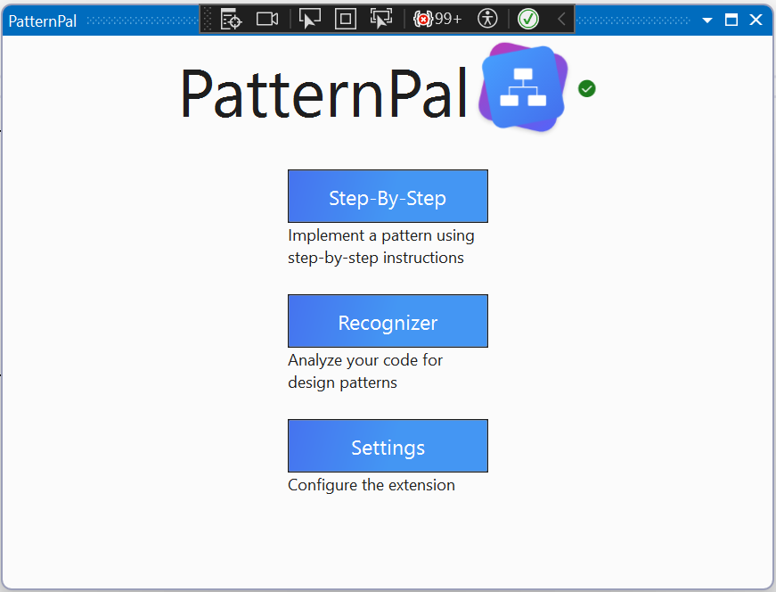
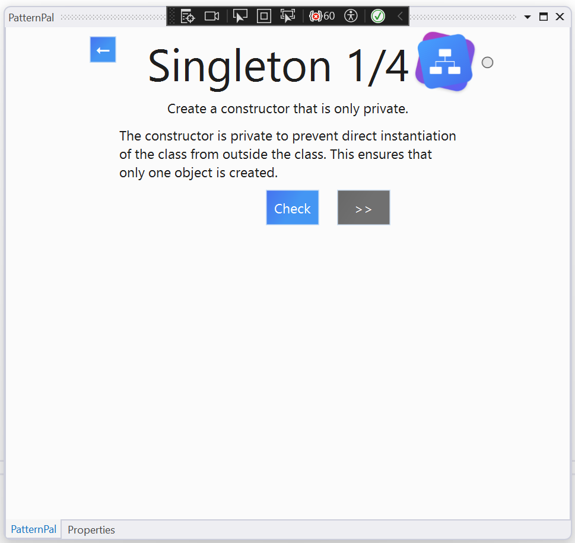

# Step-by-Step User Guide

PatternPal's Step-by-Step functionality provides an approach to implementing software design patterns in your projects. This section outlines the steps to use this feature.

## Step 1: Open PatternPal

Launch PatternPal within the Visual Studio IDE. This can be found in the main menu under `View > Other Windows > PatternPal`. After opening PatternPal, you can select the 'Step-by-Step' from the main menu.

## Step 2: Select a Pattern

Choose a pattern from the available options. The Step-by-Step functionality is available for a subset of all the patterns in PatternPal. For this example, we will use the `Singleton` pattern.

## Step 2a. Existing Pattern or New Pattern

If you have already implemented the pattern in your codebase, select "Continue work on pattern". If you are implementing the pattern for the first time, select "Implement new pattern".

## Step 3: Follow the Steps

The Step-by-Step functionality provides a series of steps to guide you in implementing the selected pattern in your code. Each step contains instructions and requirements. Follow them carefully to complete the pattern implementation.

### Next Button

Use the 'Next' button to proceed to the next step.

### Check Button

Click the 'Check' button to verify if you have correctly implemented the requirements of the current step.

*Figure 1: Step-by-Step Buttons*

*Figure 2: Step Instructions and Feedback when correct*

*Figure 2: Step Instructions and Feedback when incorrect*

## Step 4: Finish

Once you have completed all the steps and successfully implemented the pattern, you can close the Step-by-Step tab.